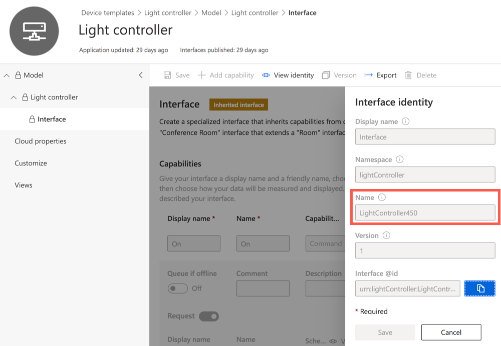

# Neopixel holiday lights controller function

An Azure Function to control the lights set up at using the code at [aka.ms/NeopixelHolidayLights](https://aka.ms/NeopixelHolidayLights).

To use this function app:

1. Complete the lab at [aka.ms/NeopixelHolidayLights](https://aka.ms/NeopixelHolidayLights) to create the IoT powered holiday lights

1. Add the following entries to the `local.settings.json` file:

    | Key | Value |
    | --- | ----- |
    | API_KEY | An IoT Central API key for your light controller app with at least operator permissions |
    | IOT_CENTRAL_APP_URL_ROOT | Your IoT Central app name (the first part of the IoT Central URL before `.azureiotcentral.com`) |
    | INTERFACE_IDENTITY_NAME | The name of the identity of your interface |

    You can get the interface identity name by selecting the interface in the device templates, then selecting **View identity** and getting the value of the *Name* field.

    

1. Run the functions app locally or deploy to Azure

To use the `On` function, pass the colour requested as a query string:

> Note the English spelling of colour! 🏴󠁧󠁢󠁥󠁮󠁧󠁿

```sh
http://localhost:7071/api/LightsOn?colour=FF0000
```

To use the `Off` function, just call the API directly:

```sh
http://localhost:7071/api/LightsOff
```
